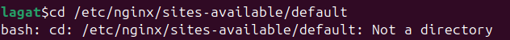
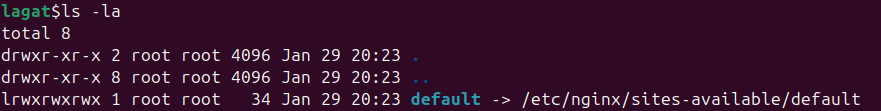

DevOps Internship at HNG!🚀

# Nginx Installation and Configuration 🚀

During my DevOps internship, I had the opportunity to work on installing and configuring Nginx, a high-performance web server and reverse proxy server. Here’s a quick overview of the steps I followed and key insights I gained!

<strong> 🔧 Approach:</strong>

- Installation: I started by installing Nginx on a Ubuntu server using apt-get for easy installation:

`sudo apt update`

`sudo apt install nginx`

- Starting Nginx: After installation, type `localhost` in your browser. If you are getting:
  

 <em>Yaay! You've successfully installed nginx.</em>

- Creating HTML page: Still on your terminal, change directory to `/var/www/html` then create an index.html file.

`cd /var/www/html`

`sudo vi index.html`

- Customize the html file to your liking! Here's an example to get you started:

- Configuration: Nginx's configuration files are located in /etc/nginx/. Firstly, open a new terminal<em>(Ctrl+Alt+t)</em> then:

`cd /etc/nginx/sites-enabled`

`sudo service nginx restart`

`sudo service nginx status`

- Testing: I tested the installation by accessing the server’s public IP address in a browser e.g `http://192.168.235.233/`

<strong> 💡 Challenges and Solutions:</strong>

🔴 Issue: Symbolic Link & Accessing Default File.

- While configuring Nginx, I ran into a symbolic link issue that prevented me from accessing the default configuration file. At first, I thought default was a directory:

- However, when I tried to navigate into /etc/nginx/sites-available/default, I got the following error:

- The same issue occurred when I tried to cd into default directly:

- After investigating, I realized that default wasn't a directory but a plain configuration file. The correct way to interact with it was by opening it with a text editor like vim:

- I also checked if the symbolic link in /etc/nginx/sites-enabled/ was properly pointing to this file:

- If the link was missing or broken, I recreated it using:

`sudo ln -s /etc/nginx/sites-available/default /etc/nginx/sites-enabled/`

🔴 Issue:  Making Nginx Public with Ngrok
- One of the challenges I faced while working with Nginx was accessing my web server from the internet. Since my system was assigned a private IP address (e.g., 192.168.x.x), it was only accessible within my local network.

- To make my Nginx server publicly accessible, I used Ngrok, a tunneling tool that creates a secure public URL for locally running applications.

🔧 Steps to Install and Set Up Ngrok

1️⃣ Install Ngrok
- Since I was working on Ubuntu, I installed Ngrok using the following commands:

`curl -s https://ngrok-agent.s3.amazonaws.com/ngrok.asc | sudo tee /etc/apt/trusted.gpg.d/ngrok.asc >/dev/null`

`echo "deb https://ngrok-agent.s3.amazonaws.com buster main" | sudo tee /etc/apt/sources.list.d/ngrok.list`

`sudo apt update && sudo apt install ngrok`

🔍 What each command does:

- - The first command adds the official Ngrok GPG key to verify the software’s authenticity.
- - The second command adds Ngrok’s repository to my system’s package sources.
- - The third command updates my package list and installs Ngrok.

2️⃣ Authenticate Ngrok with an Authtoken
- Ngrok requires an authentication token to create secure tunnels. I followed these steps:

- - Signed up for a free account on Ngrok's website.

- - Copied my authentication token from the dashboard.

- - Configured Ngrok with my token using:

`ngrok config add-authtoken YOUR_AUTHTOKEN`

3️⃣ Start Ngrok and Expose Nginx

- Once Ngrok was set up, I started a tunnel for port 80 (where Nginx runs) using:

`ngrok http 80`

4️⃣ Getting the Public URL

👉 The public address is listed under "Forwarding".

- - I copied the HTTPS URL and tested it in a browser. 🎉 My locally hosted Nginx page was now accessible to anyone on the internet!

💡 With Ngrok, I successfully made my Nginx server accessible over the internet! 

<strong> 🌱 Learning and Professional Growth:</strong>

This task contributed significantly to my learning in DevOps. It enhanced my understanding of web server management, network configurations, and security practices. Nginx, being lightweight and highly customizable, gave me valuable experience in configuring scalable and reliable systems.

As I continue my journey, I see how mastering tools like Nginx aligns with my goals of becoming proficient in the full DevOps lifecycle—ensuring smooth deployment, system stability, and security.

🔗 Hiring skilled DevOps engineers? Check out this <a href="https://hng.tech/hire/devops-engineers">resource</a>. Oh, and if you’re looking for Automation Engineers <a href="https://hng.tech/hire/automation-engineers">click here.</a> Thank you for your time! 😊
