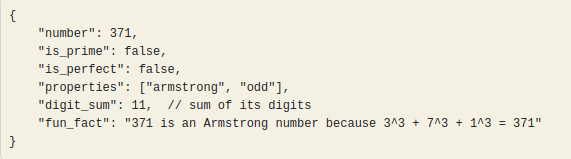
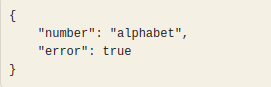

#  Number Classification API

- Create an API that takes a number and returns interesting mathematical properties about it, along with a fun fact.

## Overview

This is a simple Flask-based API that classifies numbers based on their mathematical properties. The API returns whether a number is prime, perfect, an Armstrong number, its digital sum, and a fun fact retrieved from numbersapi.com.

## Features

- - Prime Number Check: Determines if a number is prime.

- - Perfect Square Check: Determines if a number is a perfect square.

- - Armstrong Number Check: Identifies whether a number is an Armstrong number.

- - Odd/Even Classification: Classifies numbers as odd or even.

- - Digital Sum Calculation: Computes the sum of a number's digits.

- - Fun Fact Retrieval: Fetches an interesting fact about the number from numbersapi.com.

## Installation

- Create a Virtual Environment

    `python3 -m venv venv`

    `source venv/bin/activate`

- Install Dependencies

    `pip install -r requirements.txt`

## Running the API

- Start the Flask Server

    `python app.py`

- Access the API

- - Open a browser or use curl to test the endpoint:

        `curl http://127.0.0.1:5000/api/classify-number/371`

## API Endpoints

1. Classify a Number

**Endpoint:**

  `GET /api/classify-number/<int:num>`

-  Example Request:

    `curl http://127.0.0.1:5000/api/classify-number/371`

**Response(200 OK):**

2. Error Handling

**If the number fact API fails(400 Bad Request), the response will be:**

## Project Structure

Stage1/
│── app.py              # Main Flask application
│── requirements.txt    # Python dependencies
│── README.md           # Project documentation

- Dependencies

- - Flask

- - Flask-CORS

- - Requests

## Future Improvements

- Add support for additional number classifications (e.g., Fibonacci, perfect numbers)

- Improve API error handling and logging

- Add caching for frequently requested numbers