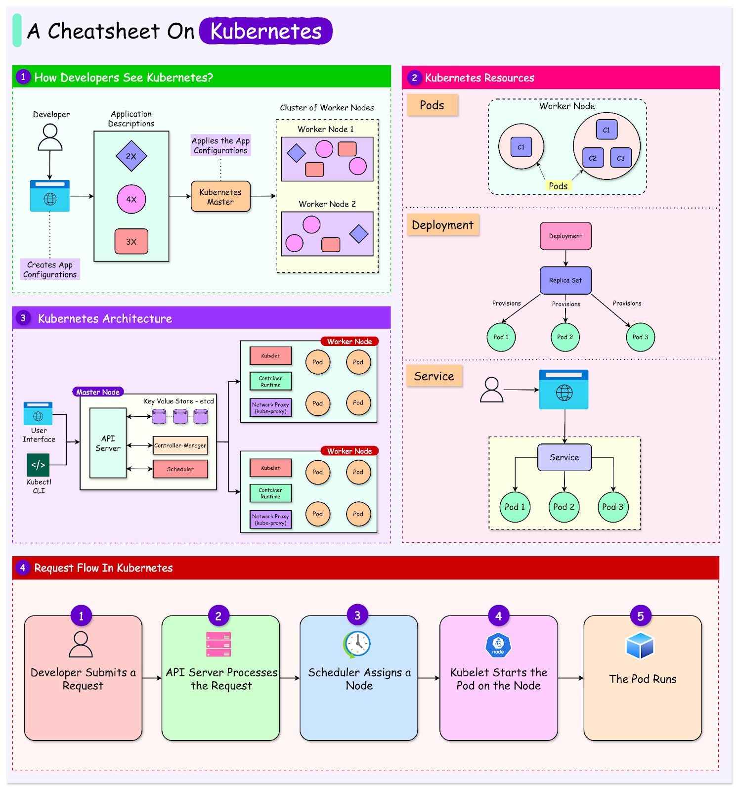

# KUBERNETES SHORT NOTES!

## TL;DR



- **K8s is now your oyster!😎**

## 🧠 Why Kubernetes Exists

### ❌ The Problem Before Kubernetes

Imagine you run a simple system:

- 🖥 **1 Web Application**
- 🧱 **1 Server**
- 📦 **Docker Containers**

Everything works well at first…

Then problems begin:

- 🚦 **Traffic spikes** → your application crashes
- 💥 **Server dies** → your entire system disappears
- 🔄 **Updating code** → causes downtime
- 📈 **You need 10 copies** → manual scaling becomes chaos

> ⚠️ This is the reality many systems faced before container orchestration.

### ✅ What Kubernetes Solves

- Scaling → run more copies automatically

- Self-healing → restart crashed apps

- Deployment → zero downtime updates

- Resource management → CPU & memory control

- Infrastructure abstraction → same setup everywhere

### 📌 Mental Model

Kubernetes is an operating system for distributed applications, not servers.

## Core Kubernetes Architecture (The Big Picture)
```text
             +----------------------+
             |     Control Plane    |
             |----------------------|
             | API Server           |
             | Scheduler            |
             | Controller Manager   |
             | etcd                 |
             +----------+-----------+
                        |
                        v
    +-------------------+-------------------+
    |                                       |
+---------------+                   +---------------+
| Worker Node 1 |                   | Worker Node 2 |
|---------------|                   |---------------|
| kubelet       |                   | kubelet       |
| kube-proxy    |                   | kube-proxy    |
| Pods          |                   | Pods          |
+---------------+                   +---------------+
```


<strong> Cluster = Control Plane + Worker Nodes </strong>

### Control Plane (The Brain 🧠) → Decides what should run and where.

- API Server: Front door of the cluster

- etcd: Database storing cluster state

- Scheduler: Chooses which node runs a pod

- Controller Manager: Fixes deviations (desired vs actual)

### Worker Nodes (The Muscle 💪) → Actually run your apps.

- kubelet : Talks to control plane, runs containers

- Container Runtime : Docker / containerd

- kube-proxy : Handles networking

📌 Analogy

Control plane = factory management

Worker nodes = factory workers

Pods = machines doing work

## Pods — The Smallest Unit (CRUCIAL)

<em> What is a Pod? </em>

- A pod is: One or more containers
- Pod shares IP address, Storage, Network namespace

<strong> NOTE📌: Kubernetes does NOT run containers directly — it runs pods. </strong>

Why Pods?

- Because some containers:

- Must run together

- Communicate via localhost
CURIOUS WHY ABSTRACTION OVER CONTAINERS IN PODS?

A container is a runtime concept, but Kubernetes needs a scheduling and management concept.
So?
- A container answers "how do I isolate a process?"
- A Pod answers "what group of processes must always live and die together?"

| Concept      | Container                          | Pod                                  |
|-------------|------------------------------------|--------------------------------------|
| Purpose     | Isolates a process                 | Groups containers together           |
| Lifecycle   | Runs independently                 | Containers live & die together       |
| Scheduled by| Runtime (Docker/containerd)        | Kubernetes Scheduler                 |
| IP Address  | Has its own                        | Shared within pod   

Kubernetes schedules Pods, not containers, because the unit of scheduling must match the unit of co-location — and that's almost never a single container in a real system.

📌 Example:

- App container + logging sidecar

- App container + metrics exporter

Reality Check:

- You almost never create pods directly.
- Controllers do that for you.

## Controllers — The Real Power

- Controllers maintain desired state.

#### Deployment (MOST IMPORTANT)

- Manages stateless apps.

- Ensures N replicas running

- Handles rolling updates

- Replaces crashed pods

📌 Example:

- replicas: 3


<em> If one pod dies → Kubernetes creates another automatically. </em>

📌 Analogy

Deployment is manager saying:
“I want 3 cashiers working at all times.”

#### ReplicaSet

- Created by Deployment

- Tracks number of pods

- You rarely touch it directly.

#### StatefulSet

- Used for:

- - Databases

- - Stateful apps

- Features:

- - Stable pod names

- - Persistent storage

- - Ordered startup/shutdown

📌 Example

MySQL, PostgreSQL, Kafka

#### DaemonSet

- Runs one pod per node.

📌 Example:

- Log collectors

- Monitoring agents

### Services — How Pods Talk
The Problem

Pods:

- Die

- Get recreated

- Change IPs

Service Solves This

Provides:

- Stable IP

- Stable DNS

- Load balancing

Types of Services

- ClusterIP (Default) → Internal access only

- NodePort → Exposes app via node IP + port

- LoadBalancer → Creates cloud load balancer (AWS, GCP)

📌 Analogy

Service = receptionist
Pods = employees who come and go

### Ingress — Smart Traffic Routing

Ingress: Routes HTTP/HTTPS traffic

Based on:

- Domain

- Path

📌 Example:

```bash
/api → backend
/ → frontend
```

Ingress needs:

- Ingress Controller (NGINX, ALB, Traefik)

### ConfigMaps & Secrets — Configuration Management

ConfigMap Stores:

- Environment variables

- App configs

Secret Stores:

- Passwords

- Tokens

- Keys (base64 encoded)

📌 Rule

- Never bake config into Docker images.

### Volumes & Persistent Storage

<em>Why?</em>

- Pods are ephemeral(die).

- PersistentVolume (PV)

- Actual storage

- PersistentVolumeClaim (PVC)

- Request for storage

📌 Analogy

PVC = asking landlord for space
PV = the actual apartment

### Scheduling, Resources & Limits (Often Ignored → Disaster)

Each pod can request:

- CPU

- Memory

```yaml
requests:
  cpu: "250m"
limits:
  cpu: "500m"
```

📌 Prevents:

- Noisy neighbors

- Node crashes

## Kubernetes Networking (Simplified)

Rules:

- Every pod gets its own IP

- Pods can talk to each other freely

- No NAT between pods

- CNI plugins:

- - Calico

- - Flannel

- - AWS VPC CNI (EKS)


# ⚠️ Common Beginner Mistakes

- Creating Pods manually instead of Deployments
- Ignoring resource limits
- Hardcoding secrets
- No monitoring/logging
- Not understanding networking


K8 IN CLOUD : EKS ARCHITECTURE

                 Internet
                    |
                    v
               AWS ALB (Ingress)
                    |
                    v
               EKS Cluster
        +-------------------------+
        |  Control Plane (AWS)    |
        +-------------------------+
                    |
        +-------------------------+
        |   Worker Node Group     |
        |   (EC2 Instances)       |
        |   Pods running here     |
        +-------------------------+

<em> Have you heard of Kubernetes in kubernetes(aka Kubeception)? </em> 