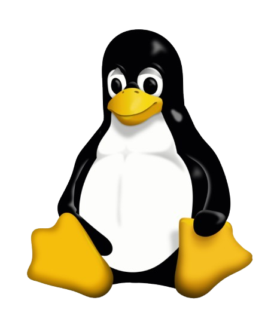
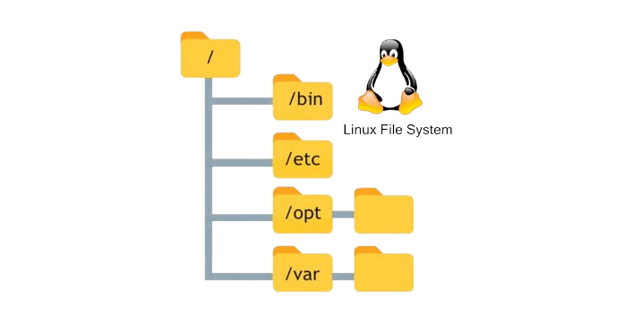

# My DevOps Journey!
Welcome to my DevOps journey! This README is designed to document my path into the DevOps field, highlight key concepts and projects, and serve as an educational resource for anyone interested in building their skills in DevOps, Linux, and related technologies.

## Table Of Content:

- [Overview](#overview)
- [Goals-and-objectives](#goals-and-objectives)
- [Learning-modules](#learning-modules)
- [LINUX](#linux)
  -  [Basic Commands](#basic-commands)
  -  [File System Structure](#file-system-structure)
  -  [Core Components of Linux: From Kernel to Command Line](#core-components-of-linux)
  -  [Permissions and Ownership](#permissions-and-ownership)
  -  [Shell Scripting](#shell-scripting)
  -  [Networking](#networking)

## Overview
DevOps, short for Development and Operations, is a collaborative approach that bridges the gap between software development and IT operations. It aims to streamline the process of delivering high-quality software, automating workflows, and maintaining systems at scale. In this journey, I explore the core components of DevOps, from foundational Linux skills to advanced automation, continuous integration and delivery, and cloud infrastructure management.

## Goals and Objectives
The primary goals for my DevOps learning journey include:

- Mastering Linux: Deepen understanding of the Linux file system hierarchy, commands, and system administration skills.
- Polishing Programming Skills: Enhance proficiency in C and Python for scripting and automation tasks.
- Learning DevOps Tools and Techniques: Gain practical knowledge of DevOps tools and processes, including CI/CD, containerization, and configuration management.
- Completing Relevant Courses and Certifications: Finish Google Coursera DevOps courses and other curated educational resources by December 2024.
- Building Real-World Projects: Work on impactful projects, such as an image-based tomato disease detection system, to apply DevOps practices and showcase skills.
- Reading and Researching: Continue learning about DevOps trends, the future demand for DevOps, and the potential impacts of AI on the field.
## Learning Modules
1. Linux Fundamentals

- Understanding the Linux file system hierarchy and organization (e.g., /bin, /etc, /var, /usr, /home).
- Managing files and directories, permissions, and system processes.
- Learning file handling and manipulation commands (e.g., grep, awk, cut, and find).
- Bash scripting for automation, loops, and conditional statements.
- Mastering SSH and secure file transfers for remote operations.

### LINUX
 

#### Basic Commands:

Here are some essential Linux commands to get started:
- `ls` - Lists files and directories
- `cd` - Changes the directory
- `pwd` - Prints the working directory
- `cp` - Copies files or directories
- `mv` - Moves or renames files or directories
- `rm` - Removes files or empty directories

#### File System Structure:

Understanding the Linux file system hierarchy is key. Here are some important directories:

- <strong><em> For a deeper dive? Let's goooo! </em></strong>

**/**: Root Directory

**├── bin**: Essential binaries for system and user commands e.g ls, mv, and cp

**├── boot**: Boot loader files, including the kernel

**├── dev**: Device files, representing hardware (e.g., disks, USB)

**├── etc**: System-wide configuration files

**├── home**: User home directories (e.g., /home/user)

**├── lib**: Shared libraries and modules

**├── media**: Mount point for removable media (CD-ROMs, USBs)

**├── mnt**: Temporary mount point for filesystems

**├── opt**: Optional software packages

**├── proc**: Virtual filesystem for process and system info

**├── root**: Home directory for the root user

**├── run**: System information since the last boot

**├── sbin**: System administration binaries

**├── srv**: Service data (e.g., for web servers)

**├── tmp**: Temporary files (cleared on reboot)

**├── usr**: User applications and utilities

**│         ├── bin**: Binaries for user applications

**│         ├── lib**: Libraries for user applications

**│         ├── local**: Locally installed software

**│         └── share**: Shared resources (e.g., documentation)

**└── var**: Variable files, such as logs and databases

**|            ├── log**             # Log files

**|            ├── tmp**             # Temporary files that persist across reboots

**|            └── cache**           # Application cache data

#### Core Components Of Linux: From Kernel to Command Line

<em> Wanna understand linux system architecture?</em><strong> Let's dive in! </strong>

1. Kernel
- Is the core of the operating system.
- <strong> Acts a bride between hardware and software.</strong>
- Handles low-level tasks like hardware communication and system resource management.
- Manages process scheduling, memory allocations and peripheral devices.
- Located in the `/boot` directory of the linux file system.

2. Boot Loader
- First software to run when a computer starts.
- Primary task is to load the kernel into the memory during system startups.
- Allows users to choose different kernel versions or OS to boot from.
- Most commonly used boot loader in linux is GRUB(Grand Unified Bootloader)
- Located in the `/boot` directory of the linux system.

3. File System
- The file system of linux is in a hierarchical structure, starting from the `/` (root directory).
- It organizes all directories such as `/bin`, files, applications and configurations.
- <em> I beat you've  already seen the Visual Representation of the Linux File System </em>

4. Linux Distribution
   <em> Heard of linux distro'? </em>
- Let's put it as complete OS that includes linux kernel, essential software packages and packet management tools.
- Popular ones include: Ubuntu, Fedora, Debian, Kali, CentOs, Arch.
- Distributions vary in package management, default software, and configurations.
- Package managers like APT (Debian-based), YUM (Red Hat-based), or Pacman (Arch Linux) simplify software installation and management.
- Tyically within `/usr`, `/etc`, `/var`

5. X Windows System
- <strong> Also known as x11 </strong>
- Software framework that enables the display of graphical user interfaces (GUIs) on Linux.
- In other words, it acts as a <i> "back-end" </i> that handles communication between hardware and graphical applications.
- Handles the windowing system, input devices like the mouse and keyboard, and display output.
- Examples: Xorg, i3, Openbox
- Typically found in `/etc/X11`, `/usr/share/X11`, and `/usr/bin`

6. Services
- They are background programs (daemons) that run to provide critical functionalities
- They are managed by the system's initialization tools like systemd or init.
- Located in `/etc/init.d/`, `/etc/systemd/`, `/usr/lib/systemd/system/`

7. Desktop Environment
- Provides the graphical user interface that includes windows manager, menus, file manager and panels.
- In other words, it acts as a <i> "front-end" </i> that provides a full GUI experience with tools and utilities.
- Popular DEs include GNOME, KDE Plasma, and XFCE.
- Can be customized with themes, widgets, and additional applications.
- Found in directories such as `/usr/share/`, `/etc/xdg/`, and `/home/user/.config`

8. Command Line
- Primary interface for interacting with Linux using text commands.
- Allows users to execute system commands, run scripts, and manage processes.
- Powerful tool for automation and managing the system
- Common shells include Bash, Zsh, and Fish
- Located in /bin, /usr/bin, /usr/local/bin

##### <em> Did you Know? </em>
There's a unique relationship between <strong> X Window System </strong> and <strong> Desktop Environment!</strong>
> <strong> Without the X Window System, Desktop Environments cannot function, as they rely on X11 to communicate with the hardware. Similarly, without a Desktop Environment, the X Window System is just a raw framework, making it challenging for users to interact with the system ---unless you're an expert in configuring graphical applications.</strong>

#### Permissions and Ownership

File permissions in Linux control who can read, write, or execute files. 
Basic commands for permissions:
- `chmod` - Changes file permissions
- `chown` - Changes file owner
- `chgrp` - Changes group ownership

#### Script Parameters
- Often, we need to pass parameter values to a script such as filename, date etc.
 
- Within a script, the parameter or an argument is represented with a<strong>`$` and a number or special character.</strong>

<strong> <em> Parameters and their meanings</em> </strong>

- `$0` ---> Script name
- `$1` --->  First Parameter
- `$2`, `$3` ---> Second Parameter, Third Parameter ...
- `$*` ---> All parameters
- `$#` ---> Number of Arguments

#### Networking

1. Testing and debugging

- `ping`: checks connctivity to.a host
- `Traceroute` : Trace the path packets take to a host.
- `Netcat (nc)` : Test port connectivity or transfer data
- `tcpdump` : Capture and analyze network packets.
- `nmap` : Scan networks and services

2. OSI Model Mnemonic
- All ----------> Application Layer
- People -------> Presenyation Layer
- Seem ---------> Session Layer
- To -----------> Transport Layer
- Need ---------> Network Layer
- Data ---------> Data Link Layer
- Processing ---> Physical layer

    - <em> I'll keep updating as we learn and grow together!</em> <strong>Happy Coding.</strong>
